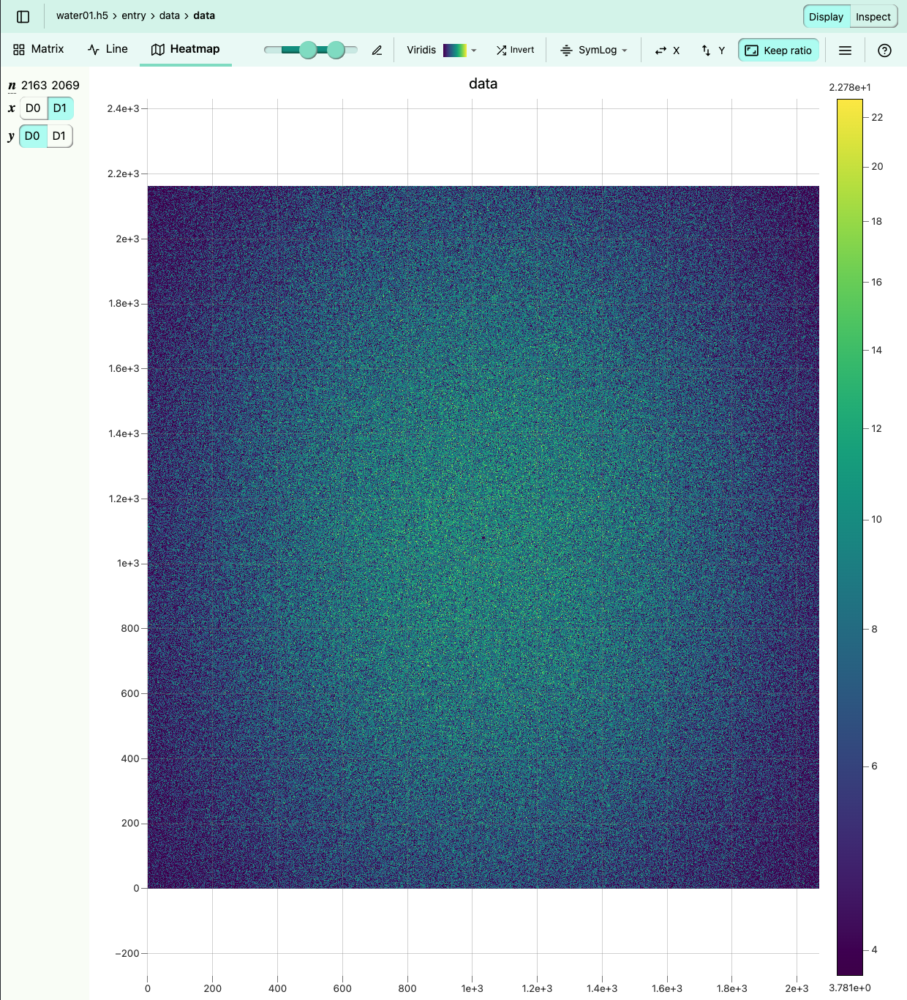
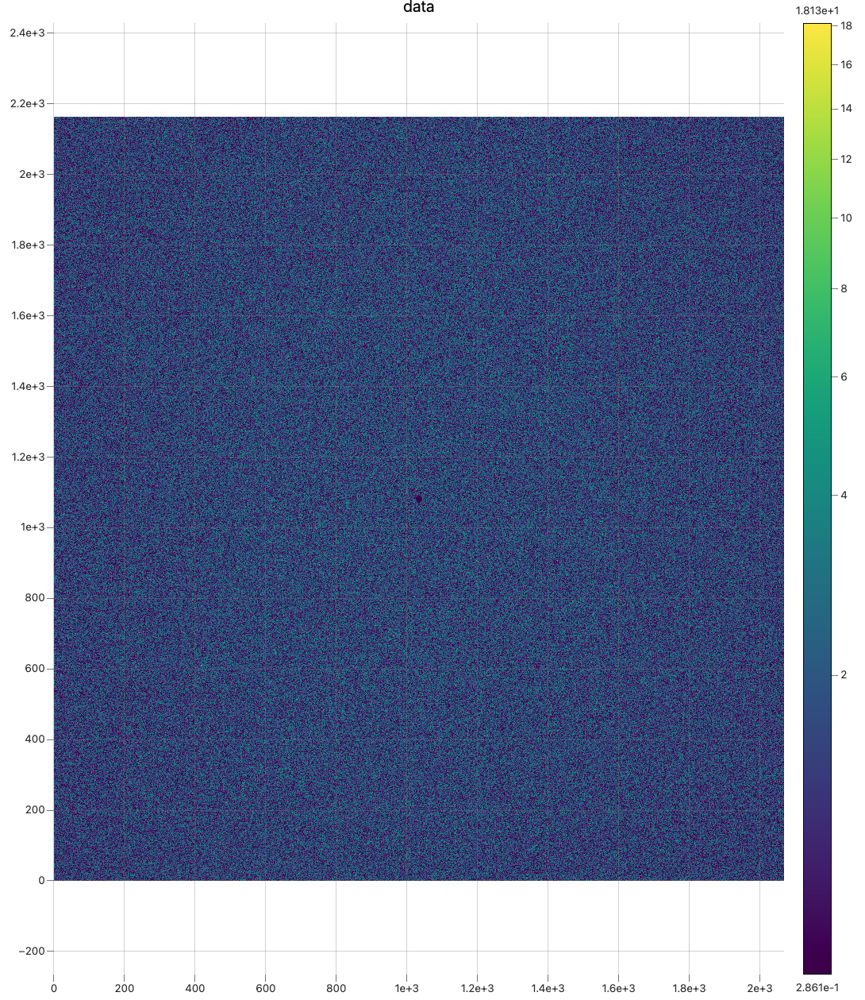
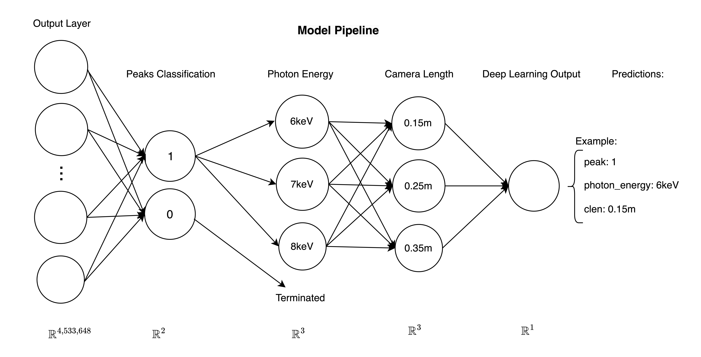
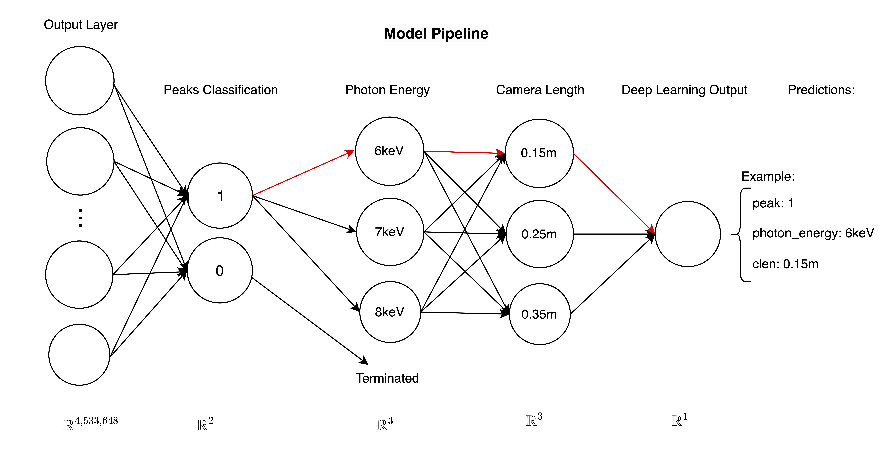
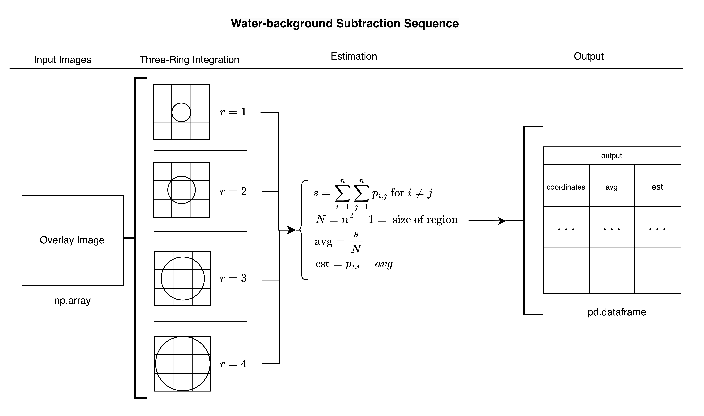

## Enhancing X-ray Peakfinding Through Deep Learning at the Compact X-ray Light Source (CXLS), Arizona State University

Kurth, A. M.1, Everett, E.1, Botha, S.1,2

*The Biodesign Beus CXFEL Laboratory, Arizona State University, Tempe, AZ 85287, USA. 1. Department of Physics, Arizona State University, Tempe, AZ 85287, USA*

Repository can be found here: [cxls_hitfinder](https://github.com/adamkurth/cxls_hitfinder.git)

### Abstract:

This paper explores the application of deep learning techniques at Arizona State University's (ASU) Compact X-ray Light Source (CXLS) to analyze experimental data from various modalities, primarily focusing on X-ray crystallography using the Dectris Eiger 4M detector. Traditional methods of predicting photon energy and sample-detector distance are challenged by dynamic scattering and intrinsic noise, prompting the need for more advanced solutions. Utilizing the CrystFEL software, we simulate diffraction images for protein 1IC6.pdb across a matrix of nine variable combinations involving photon energies and camera length. Our approach employs convolutional neural networks (CNNs), testing various architectures for binary classification of peak detection and prediction of experimental parameters. The scope of this research wishes to further expand this with modifications in the architecture to accomadate for spectroscopy data, although this is beyond the extent of this manuscript. By integrating different experimental conditions, we anticipate broader applications and improved experimental outcomes.

### Introduction:

At Arizona State University (ASU), we are at the forefront of developing the world's first Compact X-ray Light Source (CXLS), a scaled-down version of the traditionally large X-ray Free-Electron Lasers (XFELs), which typically extend over a kilometer. This revolutionary device emits X-ray pulses at the femtosecond scale and operates at a kilohertz frequency. Despite its scaled-down size, approximately 60 feet in length compared to the mile-long accelerators used in traditional sources, the CXLS retains the functional capabilities of its larger counterparts.

The compact nature of the CXLS not only results in significant cost reductions but also facilitates the broader distribution of these advanced technological units. The affordability and accessibility provided by the CXLS have the potential to revolutionize a variety of research fields, including materials science and pharmaceuticals, positioning ASU as a leader in fostering innovative research across these vital areas.

Central to the functionality of the CXLS is the Dectris Eiger 4M detector, known for its high resolution and sensitivity, which are crucial for capturing intricate diffraction patterns from protein crystals. However, the analysis of these patterns is complex and often labor-intensive, necessitating manual corrections to address data inaccuracies. Additionally, the CXLS's low flux X-ray beam complicates peak detection in both crystallography and spectroscopy images. The presence of dynamic scattering patterns, largely due to the water content within protein samples, further complicates analyses. These challenges underscore the need for developing advanced methodologies that improve both the precision and efficiency of data processing at the CXLS.

### Methods:

In this investigation, we utilize the capabilities of the Dectris Eiger 4M detector to refine X-ray crystallography methodologies at the CXLS facility. Given the challenges posed by the low flux X-ray beam and the complex relationship between photon energy and sample-detector distances, our research employs advanced computational strategies to enhance data analysis precision.

To mitigate these complexities, we have developed CNNs designed to improve the accuracy of predicting photon energy and sample-detector distances. The CNNs are trained on simulated diffraction images generated via the `pattern_sim` module of the CrystFEL[1] software suite. These simulations closely mimic the scattering patterns and intrinsic noise characteristic of real experimental data, providing a robust foundation for training our deep learning models.

Our experimental design is meticulously structured around a matrix of variables that include camera length, or "clen", and photon energy, assessed at three increments—0.15, 0.25, and 0.35 meters for camera length, and 6, 7, and 8 keV for photon energy. This setup results in nine distinct experimental conditions, each crafted to evaluate the CNNs' capability to process and analyze diverse and intricate data scenarios:

Below is the matrix of parameters used in the data generation process:

| Dataset (`01`-`09`) | camera length (m) | photon energy (keV) |
|---------------|------------|---------------------|
| `01`          | 0.15        | 6                   |
| `02`          | 0.15        | 7                   |
| `03`          | 0.15        | 8                   |
| `04`          | 0.25        | 6                   |
| `05`          | 0.25        | 7                   |
| `06`          | 0.25        | 8                   |
| `07`          | 0.35        | 6                   |
| `08`          | 0.35        | 7                   |
| `09`          | 0.35        | 8                   |

This systematic approach not only facilitates the rigorous examination of the various image appearences under different experimental conditions. Each parameter combination within the matrix is utilized to generate specific diffraction images, enabling a thorough analysis of the CNN’s efficacy under different experimental conditions. The application of these parameters in our CNN model is intended to create a tool that is adept at managing the complexities of real-world experimental settings. 

First step is detecting whether or not a given image contains peaks, this is a binary classification problem. The nature of the data is such that the peaks are not very pronounced at our experimental parameters. Despite this deceptively simple task, the model must be given both the `peaks` and `peak_water_overlay` images to help identify the features of the peaks, or else the model will give a very low accuracy and risk overfitting. At this stage, we use the `ResNet` (?) architecture, which has been proven to be effective in image classification tasks. 

After the model predicts the presense of peaks in the image data, the model must predict the parameters next. This is implemented in `pipe.py` and is the most crucial part of the model. At this stage, the model predicts first photon energy, and camera length in that order. This ordering is arbitrary, but both influence the appearance of the realistic diffraction images (called overlay images). 

As photon energy increases, the photons will transfer more momentum during scattering causing a different scattered angle. And as the distance of the detector and the sample increase, the solid angle of the scattered photons will create a larger area of incident photons on the detector face. This conic shape of the scattered photons is what creates the water-ring in the diffraction images.
 
#### Overall Structure of the Repository:

The repository structure is organized to facilitate the efficient management of the project's codebase, documentation, and data. 
The following is an overview of the repository structure:

```bash
cxls_hitfinder/
    ├── .gitignore
    ├── .gitkeep
    ├── .gitmodules
    ├── cnn/
    │   ├── models/
    │   │   ├── cnn3_test.pt
    │   │   ├── ...
    │   ├── src/
    │   │   ├── pkg/
    │   │   │   ├── __init__.py
    │   │   │   ├── ...
    │   │   │   ├── water_background/
    │   │   │   │   ├── finder/
    │   │   │   │   │   ├── __init__.py
    │   │   │   │   │   ├── ...
    ├── docs/
    │   ├── diagrams/
    │   ├── directions/
    │   ├── report.md
    ├── images/
    │   ├── labels/
    │   ├── peaks/
    │   ├── peaks_water_overlay/
    │   ├── temp/
    │   ├── water/
    ├── scripts/
    │   ├── param_01_09_directory_struct.sh
    │   ├── assign_params.py
    │   ├── checks.sh
    │   ├── peak_water_overlay_label_dir_struc.sh
    │   ├── reformat-h5.py
    │   ├── reformat-h5.sh
    │   ├── rename_directories_parameters.py
    ├── requirements.txt
    └── README.md
```

- `.gitignore` and `.gitkeep` are utilized to manage the exclusion of files in Git, specifically targeting large HDF5 files.
- `.gitmodules` outlines the submodules for the project, notably `waterbackground_subtraction`.
- `cnn/` houses all files pertinent to the Convolutional Neural Network (CNN) models and source code.
    - `models/` contains saved states of trained CNN models.
    - `src/` holds the source code implementing the CNN.
        - `pkg/` includes the primary Python package.
            - `waterbackground_subtraction/` houses code for detecting and analyzing water backgrounds within protein samples.
                - `finder/` contains the methods used for peak analysis through a three-ring integration technique.
- `docs/` is a directory for storing documentation for this project.
    - `diagrams/` stores visual aids and diagrams.
    - `directions/` includes guidelines and procedural instructions for the project.
    - `report.md` is a comrehensive Markdown report detailing project findings.
- `images/` stores all imagery data, organized by specific data sets corresponding to parameter combinations.
  - `labels/`, `peaks/`, `peaks_water_overlay/`, and `water/` subdirectories categorize images based on their processing stage and content.
- `scripts/` is a directory for storing scripts useful to use on the supercomputer.
  - `param_01_09_directory_struct.sh`, `assign_params.py`, `checks.sh`, `peak_water_overlay_label_dir_struc.sh`, `reformat-h5.py`, `reformat-h5.sh`, and `rename_directories_parameters.py` provide a range of functionalities from managing directory structures to renaming files for consistency.
- `requirements.txt` lists all dependencies required for the project, ensuring reproducibility of the environment.
- `README.md` offers a general introduction and guide to navigating the project repository.

#### `pkg` Module:
The `pkg` directory forms the core Python module for our project, housing the implementation of the Convolutional Neural Network (CNN) model. This package is meticulously organized as follows:

``` bash
pkg/
    ├── __init__.py
    ├── process.py
    ├── path.py
    ├── data.py
    ├── models.py
    ├── eval.py
    ├── train_eval.py
    ├── pipe.py
    ├── functions.py
    ├── transform.py
    ├── waterbackground_subtraction/
    │   ├── finder/
    │   │   ├── __init__.py
    │   │   ├── background.py        
    │   │   ├── datahandler.py
    │   │   ├── functions.py
    │   │   ├── imageprocessor.py
    │   │   ├── region.py
    │   │   ├── threshold.py
```

Key Components of the `pkg` Module:
-`__init__.py` initializes the Python module, setting up namespace and imports.
- `process.py` handles most of the data preprocessing, including image labeling and overlaying peaks with water background images.
- `path.py` manages dynamic path configurations for datasets across preprocessing, training, and testing phases.
- `data.py` oversees data loading and dataset creation for models, utilizing PyTorch's `Dataset` class.
- `model.py` contains the classes for the various models used in the project.
- `eval.py` assesses the performance of the models.
- `train_eval.py` orchestrates model training and evaluation.
- `pipe.py` establishes the pipeline for model predictions based on `DataLoader` images.
- `functions.py` contains the miscellaneous functions used in the `pkg` module.

#### `waterbackground_subtraction` Submodule:
The `waterbackground_subtraction` directory is a submodule from [waterbackground_subtraction](https://github.com/adamkurth/waterbackground_subtraction.git) under the branch `simplified_for_hitfinder`. This submodule is dedicated to water background detection and analysis, crucial for accurate peak estimation using advanced techniques. Here's a breakdown of its structure:

``` bash
waterbackground_subtraction/
    ├── finder/
    │   ├── __init__.py
    │   ├── background.py
    │   ├── datahandler.py
    │   ├── functions.py
    │   ├── imageprocessor.py
    │   ├── region.py
    │   ├── threshold.py
```
Files within `waterbackground_subtraction`:

- `__init__.py` is the initialization file for the Python package.
- `background.py` implements sophisticated single and multiple image three-ring integration techniques for background analysis.
- `datahandler.py` contains the class for handling the data for the overwritting of the stream files, not necessary for the project.
- `imageprocessor.py` processes and visualizes images for further analysis.
- `region.py` defines regions of interest (ROI) used in the three-ring integration techniques described in `background.py`.
- `threshold.py` sets thresholds for image analysis, also used in the three-ring techniques.

#### Data Directory Structure:

Located in the root directory of the repository, the `images/` directory contains the data used in the project. The data is structured as follows:

``` bash
images/
    ├── peaks/
    |   ├── 01/
    |   |   ├── 01_6keV_clen01_000000.h5
    |   |   ├── ...
    |   ├── 02/
    |   |   ├── 02_7keV_clen01_000000.h5
    |   |   ├── ...
    |   ├── ... 
    |   ├── 09/
    |   |   ├── 09_8keV_clen03_000000.h5
    |   |   ├── ...
    ├── labels/
    ├── peaks_water_overlay/
    ├── water/
```

Here, all directories have the same `01` through `09` structure, with each directory containing the images for the respective dataset.

Note the contents of `images/`:
- `peaks/` contain the Bragg peaks images from the simulated diffraction images, the peaks are simulated using CrystalFEL software and do not contain any noise in the images. 
- `water/` contains the different keV and camera length water images to overlay with `images/peaks` images.
- `labels/` contains the labels for the Bragg peaks (0 for no peak, 1 for peak present), these are generated from the `peaks/` images.
- `peaks_water_overlay/` contains the Bragg peak images (`peaks/`) overlayed with the respective water-background images (`water`). 

### Data Generation and Preprocessing:  

#### Data Generation:

As stated previously, we use the `pattern_sim` module in CrystFEL. For our simulations, we use the protein designated as 1IC6.pdb, sourced from the RCSB Protein Data Bank[2]. Initially, our experiments are concentrated on a medium-sized unit cell, simplifying the complexity of the analysis while offering potential for future research expansion.

Prior to initiating the `pattern_sim` simulations, it was imperative to construct a crystal file and generate corresponding water-background images tailored to specific photon energy and camera length parameters as outlined in our parameter matrix. To create these images, we utilize the [reborn](https://gitlab.com/kirianlab/reborn)[3] software, where the `water_background.py` script dynamically produces water-background images for designated photon energy and camera length settings extracted from the `Eiger.geom` file. These images are subsequently stored in the `images/water` directory for integration into our simulations

For the crystal file generation, we employ the sfall module from the CCP4[4] software suite to calculate the structure factors of the protein under study. This process yields an `.hkl` file containing the Miller indices relevant to the specific PDB file. The crystal file itself is a text document detailing critical structural information such as unit-cell dimensions and the crystal's space group. This information is crucial to ensuring that our simulations accurately replicate the expected diffraction patterns from the protein crystal, thereby enabling precise structural analysis.

##### Water-Background Noise:

The water-background noise is a the main point of interest in this project. To preface, the water-background noise is a dynamic variable that adjusts based on the combination of photon energy and camera length.

Both, photon energy and camera length are specified in the `Eiger4M.geom` file, which the reborn's `water_background.py` script accesses. Water background noise is crucial as it accurately simulates the scattering patterns resulting from the water content within protein samples, thereby enhancing the authenticity of the simulated diffraction data.

The configuration of the `Eiger4M.geom` file is as follows:
```
; Eiger for CXLS simulations
; EIGER 4M (2162, 2068) 
; Camera length (in m) and photon energy (eV)

;example!
clen = 0.35
photon_energy = 8000
;...
```
Below are visual representations of water-background noise for two specific photon energies (6000 eV and 8000 eV), with the camera length held constant at 0.15 meters. These images demonstrate how variations in photon energy influence the momentum transfer during X-ray scattering, which directly affects the scattering angle. This change in angle impacts the solid angle of the scattered photons, altering the area they cover on the detector's surface. Higher photon energies result in greater momentum transfers, leading to altered scattering angles. Simultaneously, the fixed camera length means that as the distance between the sample and the detector increases, the solid angle expands, spreading the incident photons across a broader area of the detector face. This expansion and the conic dispersion pattern of the scattered photons are responsible for the formation of the water-ring observed in the diffraction images.

The proximity of the protein sample to the detector critically influences the visibility of the water-ring effect. This phenomenon occurs because the increased scattering of X-rays by the water within the protein sample intensifies the water background noise in the diffraction images. By integrating this noise into our simulations, we aim to enhance the authenticity of the data. This, in turn, improves the accuracy and reliability of our analyses of protein crystal structures, offering deeper insights into their molecular arrangements.

<p float="left">
    
     
</p>

*Figure 1: Water background noise comparison. Left: (`water01.png`) photon energy is 6000 eV, with camera length is 0.15m. Right: (`water07.png`) photon energy is 8000 eV, with camera length is 0.15m. Both images can be found in `docs/diagrams/`*

##### Crystal Used in Simulations:

According to the RCSB Protein Data Bank, the *proteinase K from Tritirachium album limber* is characterized by a resolution of 0.98 Å. This enzyme is part of the tetragonal crystal system and belongs to the space group $P 4_3 2_1 2$. The unit cell dimensions are defined as $a = b = 58.3$ Å, $c = 63.6$ Å, with the point group being $4/mmm$, or $422$. This deatiled structural information is fundamental to our analysis and facilitates a more precise understanding of the protein's diffraction patterns. Below is a visual representation of the tetragonal crystal system:


*Figure 2: Tetragonal Crystal System*. Available from: [Wikipedia](**https**://en.m.wikipedia.org/wiki/File:Tetragonal.svg)

#### `pattern_sim` Parameters:

The `submit.sh` script, is located in the `scripts/` directory and is responsible for configuring the parameters used in the `pattern_sim` simulations, and submitting jobs. The script's parameters is structured as follows: 

```bash
#!/bin/bash

# Global configurations
NAME="$1"                              # Experiment or job prefix
TASKS="$2"                             # Number of tasks to request for each job
PHOTON_ENERGY="$3"                     # Photon energy input
# ...
# pattern_sim specifications
GEOM="Eiger4M.geom"                    # Geometry file
CRYSTAL="1IC6.cell"                    # Crystal file
INPUT="1IC6.pdb.hkl"                   # Constant HKL input file
POINT_GROUP="4/mmm"
CRYSTAL_SIZE_MIN=1000
CRYSTAL_SIZE_MAX=1000
SPECTRUM="tophat"
SAMPLING=7
BANDWIDTH=0.01
N_PHOTONS=3e8
BEAM_RADIUS=5e-6
NUMBER_OF_PATTERNS=10000
# ...
```

The `pattern_sim` command is executed within the bottom half of `submit.sh`, with the following command structure:

```bash
pattern_sim -g $GEOM -p $CRYSTAL --number=$cores -o $job_name -i $INPUT -r -y $POINT_GROUP --min-size=$CRYSTAL_SIZE_MIN --max-size=$CRYSTAL_SIZE_MAX --spectrum=$SPECTRUM -s $SAMPLING --background=0 --beam-bandwidth=$BANDWIDTH --photon-energy=$PHOTON_ENERGY --nphotons=$N_PHOTONS --beam-radius=$BEAM_RADIUS
```

The `pattern_sim` command generates the diffraction images based on the specified parameters, including the photon energy, crystal file, and geometry file. The resulting diffraction images are then stored and renamed appropriately for our uses. Note that at this stage, the outputted images are signal only, and will be stored in `images/peaks` after renaming the files to reflect the dataset's parameters.

#### Data Preprocessing:

In `pkg` directory, every file is responsible for a class or functions in the Python module. Most of these are dealing with preprocessing the data for eventual use in the CNN model. 

``` bash
pkg/
    ├── __init__.py
    ├── path.py
    ├── data.py
    ├── arch.py
    ├── functions.py
    ├── eval.py
    ├── pipe.py
    ├── process.py
    ├── models.py
    ├── train_eval.py
    ├── transform.py
    ├── waterbackground_subtraction/
    │   ├── finder/
    │   │   ├── __init__.py
    │   │   ├── background.py        
    │   │   ├── datahandler.py
    │   │   ├── functions.py
    │   │   ├── imageprocessor.py
    │   │   ├── region.py
    │   │   ├── threshold.py
```

The script `process_directory.py`, handles most of this. This script is found in `cnn/src` and is responsible for taking the simulated images from `images/peaks` and casting every pixel value to a binary value (0 or 1) based on a threshold. It is known that the simulated images contain no noise, thus the threshold can be set very low to identify all of the peaks. The script will then save the labeled images in `images/labels` for further use after the model training. This is important to keep for the identification of proteins based on the location of Bragg peaks, if this would be a helpful addition to the project and this will not be implemented in the model for training. The script also takes the corresponding water-background image from `images/water` (of the specific dataset) and overlays the peaks with the water background image, saving the images in `images/peaks_water_overlay`. These are the images are the only images that will be used in the model training.

#### Model Architectures:

The project employs CNNs because of their capability to perform heirarchical feature extraction which is important for our uses for peak detection. Early layers capture basic details, while deeper layers integrate these into more complex pattern, thus infering prediction for the camera distance and photon energy parameters. 

**TO BE CONTINUED...**

#### Model Pipeline:

The implemented architecture is defined by these parameters. After training is completed, the model predicts sequentially; whether there are peaks present in the image (peak detection), if so, it predicts photon energy then camera length. The model is trained in a pipeline style format, where the `pipe.py` file is instantiated and passed in classes corresponding to each attribute that hold the saved model data. The diagram below illustrates the model architecture:




*Figure 3: Deep Learning Pipeline* 

And the following diagram shows the sequential ordering of the model pipeline:



*Figure 4: Sequential Ordering*

The `pipe.py` file is responsible for running the method `run` which takes in an image tensor. This will first run the image through the trained peak detector model. If a peak is detected, it will then run the image through the photon energy and camera length models to identify the parameters.

This being a binary classification problem, was deceptively difficult since futher inspection of the data did not show very outstanding peak intensities that could be easily identified, even with using convolutional layers. The model **must** be given both the `peaks` and `peak_water_overlay` images to help identify the features of the peaks, or else the model will give a very low accuracy and risk overfitting. At this stage, we use the `ResNet` 


<!-- talk about pipeline as well -->

For this project we utilized convolutional neural networks (CNN) using pytorch. CNNs are an excellent for for this task because of their ability to perform hierarchical feature extraction. This is crucial for x-ray scattering images where different layers can learn to identify various features, from peaks detection or specific shapes indicative of photon energy levels and camera length. The spatial hierarchy of features in CNNs mirrors the physical structure within x-ray scattering images. Early layers capture basic details, while deeper layers integrate these into more complex patterns that are vital for accurate predictions.

Define DATALOADER, MODEL, LOSS FUNCTION, OPTIMIZER, and TRAINING LOOP.

The model architecture is defined by the parameters that need to be predicted. Immediately after training, the model first must predict whether or not there are any peaks on the image. This being a binary classification problem, was deceptively difficult since futher inspection of the data did not show very outstanding peak intensities that could be easily identified, even with using convolutional layers. The model **must** be given both the `peaks` and `peak_water_overlay` images to help identify the features of the peaks, or else the model will give a very low accuracy and risk overfitting. At this stage, we use the `ResNet` 

After the model predicts the presense of peaks in the images loading into the dataloader, the model must predict the parameters. This is implemented in `pipe.py` and is the most crucial part of the model. At this stage, the model predicts first camera length, and photon energy in that order. This is because the camera length is dependent on the photon energy, and the model must predict the photon energy first. Both parameters that are being predicted, are regression problems. 

Next, the model must predict the camera length. This is a regression problem, and the model must predict the camera length based on the features of the image. 

Ideas were thrown around to use a model that predicts the parameters all at once, but we came to the conclusion that sequential order would be the best approach. Otherwise, the model would have to predict camera length and photon energy independently from one another, which is contradictory to the nature of the data because they are dynamically dependent on one another. 

Instead of implimenting one neural network where each output node is a different combination of the possible attributes, 3 neural networks were implimented. We have done this in a pipeline sytle format. We instantiate the file pipe.py and pass in classes correspoding to each attribute that hold the saved model data. This will be elaborated on more in the training section. Once instantiated, we can run the method run in pipe.py, which takes in an image tensor. This will first run it though our trained peak detector model. This serves as a filter, were is a peak is not detected, it will not run through the other models. If an image is detected, it will run through the photon energy and camera length models and identify the 




#### Training:
<!-- make sure to reference how much data was used, how to was put into the data loader, and the 80/20 split -->
<!-- make a visual for the configuration details -->

In the development of our neural network model, we adopted the standard PyTorch training loop as a foundation and tailored the training process to our specific needs to improve model performance. Our project's goal is to learn in three categories: peak detection, photon energy, and camera length. Given the distinct nature of these attributes, it was necessary to customize the training parameters accordingly.

To make our implementation robust, we employed two types of configurations: a global configuration and specific configurations for each attribute. The global configuration is a Python dictionary that contains shared training parameters such as the data loaders, number of epochs, batch size, the optimizer, the scheduler, and the device for training. These parameters are considered global because they remain consistent across the training of different attributes.

The specific configuration, implemented through a class for each attribute, manages variables that vary from one attribute to another. These variables include the model, the feature name, the number of output classes, labels, attribute mapping, threshold, learning rate, weights, criterion, and save path.

Critical elements in the specific configuration are the models, learning rates, criterion, and weights. Each attribute required a different model and learning rate due to performance improvements observed during training. The criterion varies with the first attribute, peaks, being a binary classification problem where BCEWithLogitsLoss is more appropriate, whereas CrossEntropyLoss is used for multi-class classification tasks like photon energy and camera length. Introducing weights to the training process was particularly advantageous for peak identification. The simulated data does not have an even distribution of data points with and without peaks, thus using weights with the criterion significantly improved the speed at which the model learned.

In our program, we instantiate each specific attribute class and then create a corresponding training and evaluation class, train_eval.py, with the specific attribute class and global configuration dictionary as arguments. These arguments are organized in the constructor into global variables for all the encapsulated data. The training is initiated by calling the epoch_loop function within train_eval. This function loops over the specified number of epochs, and at each epoch, it calls a training and a testing function. This setup is advantageous because it allows for immediate evaluation of the updated parameters using the testing data, providing continuous feedback on the model’s performance during training.

Inside the training function, two key enhancements from the standard PyTorch training loop are implemented: mixed precision training, which reduces the computational cost by utilizing both float32 and float16 tensors, and the addition of an accuracy calculation to directly measure how well the training data matches its labels.

In the testing function, we utilize the loss results from the test to dynamically control our scheduler, ReduceLROnPlateau, which has proven effective in improving outcomes by adjusting the learning rate during the training process based on performance, especially in binary classification scenarios.

By adhering to this structured training approach, we have successfully tailored our neural network models to effectively learn and perform across different attributes, setting a strong foundation for their application in real-world scenarios.


### Results:


### Discussion:


### Conclusion:


### Acknowledgements:


### References:

[1] T. A. White, R. A. Kirian, A. V. Martin, A. Aquila, K. Nass, A. Barty and H. N. Chapman. *“CrystFEL: a software suite for snapshot serial crystallography”*. J. Appl. Cryst. **45** (2012), p335–341.

[2] RCSB Protein Data Bank. (n.d.). 1IC6: Structure of a serine protease proteinase K from Tritirachium album limber at 0.98 a resolution. RCSB PDB. https://www.rcsb.org/structure/1ic6 

[3] kirianlab. (n.d.). Kirianlab / reborn · GITLAB. GitLab. https://gitlab.com/kirianlab/reborn 

[4] SFALL (CCP4: Supported program). SFALL (CCP4: Supported Program) - CCP4 documentation. (n.d.). https://www.ccp4.ac.uk/html/sfall.html 

[5] White, T. A., Kirian, R. A., Martin, A. V., Aquila, A., Nass, K., Barty, A., & Chapman, H. N. (2012). CrystFEL: a software suite for snapshot serial crystallography. Journal of Applied Crystallography, *45*(2), 335-341. Retrieved from https://www.desy.de/~twhite/crystfel/manual-pattern_sim.html


