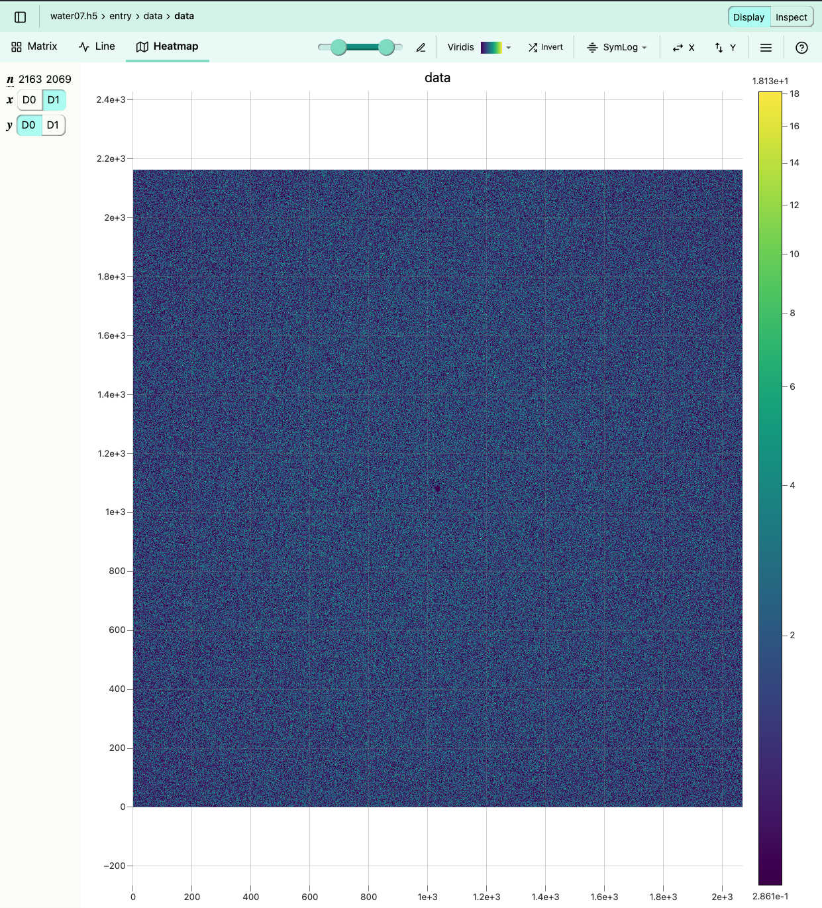
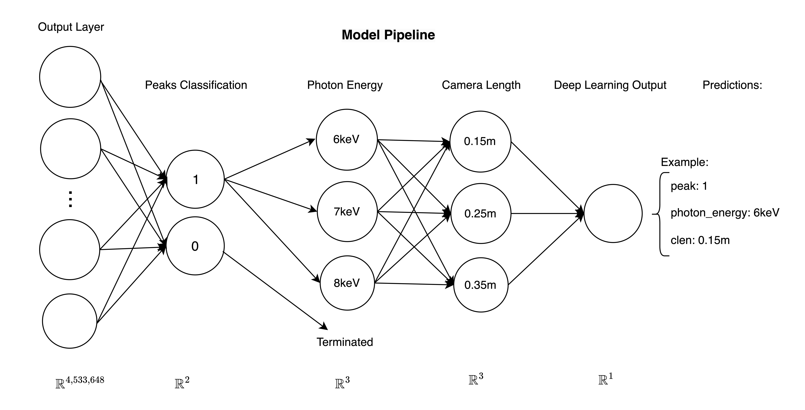
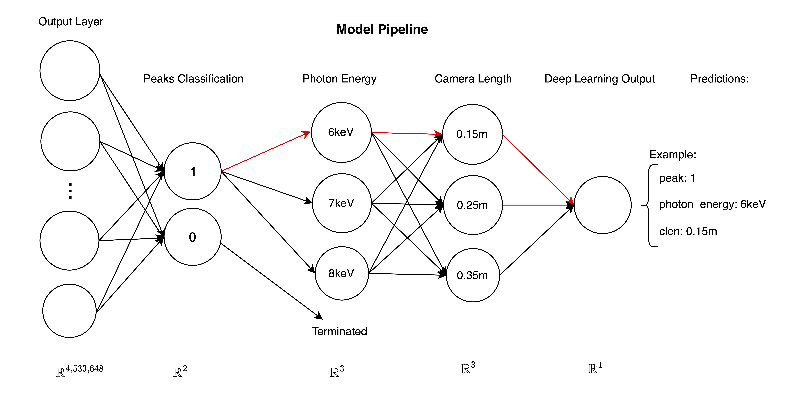
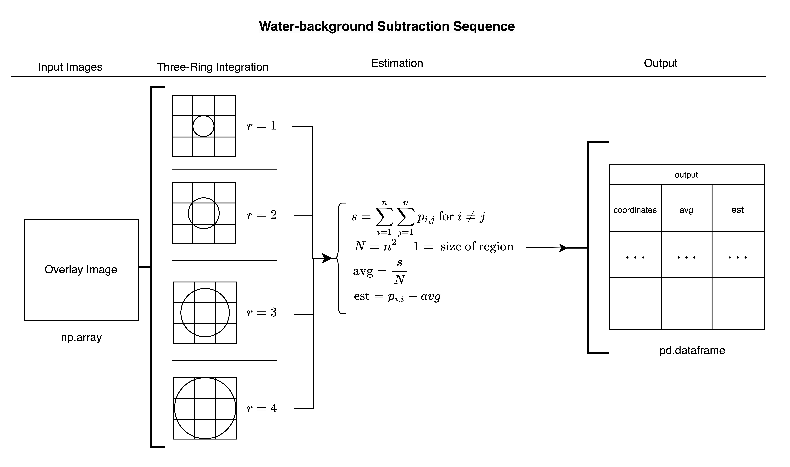

## Enhancing X-ray Peakfinding Through Deep Learning at the Compact X-ray Light Source (CXLS), Arizona State University

Kurth, A. M.1, Everett, E.1, Botha, S.1,2

*The Biodesign Beus CXFEL Laboratory, Arizona State University, Tempe, AZ 85287, USA. 1. Department of Physics, Arizona State University, Tempe, AZ 85287, USA*

Repository can be found here: [cxls_hitfinder](https://github.com/adamkurth/cxls_hitfinder.git)

### Abstract:

This paper explores the application of deep learning techniques at Arizona State University's Compact X-ray Light Source (CXLS) to analyze experimental data from various modalities, primarily focusing on X-ray crystallography using the Dectris Eiger 4M detector. Traditional methods of predicting photon energy and sample-detector distance are challenged by dynamic scattering and intrinsic noise, prompting the need for more advanced solutions. Utilizing the CrystFEL software, we simulate diffraction images for protein 1IC6.pdb across a matrix of nine variable combinations involving photon energies and camera length. Our approach employs convolutional neural networks (CNNs), testing various architectures for binary classification of peak detection and prediction of experimental parameters. This research not only aims to refine parameter prediction in X-ray crystallography but also extends the model to incorporate material science spectroscopy data, enhancing the analytical capabilities of CXLS. By integrating different experimental contexts, we anticipate broader applications and improved experimental outcomes.

### Introduction:

At Arizona State University (ASU), we are pioneering the development of the world's first Compact X-ray Light Source (CXLS). This groundbreaking apparatus is capable of emitting x-ray pulses at the femtosecond scale, operating at a frequency of a kilohertz. While the functionality of the CXLS mirrors that of existing technologies in terms of its capabilities, it distinguishes itself through its remarkably reduced size. Traditional x-ray light sources necessitate the use of linear accelerators extending over a mile in length. In contrast, the accelerator integral to the CXLS measures approximately 60 feet, significantly reducing its physical footprint.

This compact design not only translates into substantial cost savings but also paves the way for the proliferation of such machines. The accessibility and affordability of the CXLS are poised to have a transformative impact on a wide array of research domains, including materials science and pharmaceuticals. By democratizing access to advanced x-ray light sources, ASU is at the forefront of enabling groundbr eaking discoveries and innovations across these critical fields.

The CXLS is equipped with a Dectris Eiger 4M detector, which is integral to the facility's x-ray crystallography capabilities. This detector is renowned for its high resolution and sensitivity, enabling the capture of detailed diffraction patterns from protein crystals. However, the analysis of these diffraction patterns is a complex and labor-intensive process, often requiring manual intervention to correct for inaccuracies in the data. The dynamic scattering patterns resulting from the water content within the protein samples further complicate the analysis, necessitating the development of innovative methodologies to enhance the accuracy and efficiency of the process.

### Methods:

This study primarily employs the Dectris Eiger 4M detector, with a focus on X-ray crystallography. Typically, this method requires manual estimation of photon energy and the distance between the protein crystal sample and the detector, often necessitating subsequent adjustments and revision. Such estimations are further complicated by dynamic scattering patterns, which arise from intrinsic noise due to water within the protein samples.

In this research, we specifically analyze the variables of interaction distance (camera length, denoted as "clen") and photon energy. Camera length is examined at increments of 0.15, 0.25, and 0.35 meters, while photon energy is tested at 6, 7, and 8 keV. These variables are organized into three discrete levels each, resulting in a matrix of nine unique combinations of these variables. This structured approach allows for a systematic examination of how each variable combination impacts the scattering patterns and the resultant data quality.

Parameter matrix for `camera length` and `photon energy`:

| Dataset (`01`-`09`) | camera length (m) | photon energy (keV) |
|---------------|------------|---------------------|
| `01`          | 0.15        | 6                   |
| `02`          | 0.15        | 7                   |
| `03`          | 0.15        | 8                   |
| `04`          | 0.25        | 6                   |
| `05`          | 0.25        | 7                   |
| `06`          | 0.25        | 8                   |
| `07`          | 0.35        | 6                   |
| `08`          | 0.35        | 7                   |
| `09`          | 0.35        | 8                   |

This matrix serves as the foundation for the subsequent data generation and analysis, where the backend programming focus enables the simulated images to dynamically adjust for different datasets to be loaded. The data generation process involves the simulation of diffraction images using the CrystFEL software suite, renowned for its capabilities in snapshot serial crystallography. The diffraction images are generated based on a specific protein (1IC6.pdb) and tailored to the nine unique parameter combinations outlined in the matrix.

#### Overall Structure of the Repository:

The repository structure is organized to facilitate the efficient management of the project's codebase, documentation, and data. 
The following is an overview of the repository structure:

```bash
cxls_hitfinder/
    ├── .gitignore
    ├── .gitkeep
    ├── .gitmodules
    ├── cnn/
    │   ├── models/
    │   │   ├── cnn3_test.pt
    │   │   ├── ...
    │   ├── src/
    │   │   ├── pkg/
    │   │   │   ├── __init__.py
    │   │   │   ├── ...
    │   │   │   ├── water_background/
    │   │   │   │   ├── finder/
    │   │   │   │   │   ├── __init__.py
    │   │   │   │   │   ├── ...
    ├── docs/
    │   ├── diagrams/
    │   ├── directions/
    │   ├── report.md
    ├── images/
    │   ├── labels/
    │   ├── peaks/
    │   ├── peaks_water_overlay/
    │   ├── temp/
    │   ├── water/
    ├── scripts/
    │   ├── 01_09_dir_struc.sh
    │   ├── assign_params.py
    │   ├── checks.sh
    │   ├── peak_water_overlay_label_dir_struc.sh
    │   ├── reformat-h5.py
    │   ├── reformat-h5.sh
    │   ├── rename_directories_parameters.py
    │   ├── test/
    ├── requirements.txt
    ├── hitfinder_env.**yml**
    └── README.md
```

- `.gitignore` and `.gitkeep` are files that specify which files and directories to ignore in Git, namely ignoring the large HDF5 files.
- `.gitmodules` is a file that defines the Git submodules for `waterbackground_subtraction`.
- `cnn/` is a directory containing files related to the Convolutional Neural Network (CNN) implementation.
    - `models/` is a subdirectory that stores trained CNN models.
    - `src/` is a subdirectory that contains source code for the CNN implementation.
        - `pkg/` is a subdirectory that holds the main Python package for implementation.
            - `waterbackground_subtraction/` is a subdirectory and submodule cloned in the Python module `pkg` that contains code related to water background detection and analysis.
                - `finder/` is a Python package that includes code to analyze and estimate peaks using three-ring integration technique.
- `docs/` is a directory for storing documentation for this project.
    - `diagrams/` is a subdirectory for storing diagrams used.
    - `directions/` is a subdirectory for storing directions.
    - `report.md` is a Markdown file that serves as a report.
- `images/` is a directory for storing images used in the project, every dataset (`01`-`09`) is a unique combination of the parameter matrix.
    - `labels/` is a subdirectory for storing labeled images with 01-09 directories.
    - `peaks/` is a subdirectory for storing peak images with 01-09 directories.
    - `peaks_water_overlay/` is a subdirectory for storing peak images with water overlays with 01-09 directories.
    - `water/` is a subdirectory for storing the background water images, with 01-09 directories.
- `scripts/` is a directory for storing scripts useful to use on the supercomputer.
    - `param_01_09_directory_struct.sh` is a shell script for directory structure management of datasets 01-09, of the form `01_6keV_clen01`.
    - `assign_params.py` is a Python script for assigning parameters of a directory in `images/**/**`.
    - `checks.sh` is a shell script for performing checks of the number of images in `peaks`, `labels`, and `peak_water_overlay` (all in the main `images` directory) and all assigned the correct attributes.
    - `peak_water_overlay_label_dir_struc.sh` is a shell script for creating a directory structure for `peaks`, `water`, and `label` images, of which all datasets directories are created.
    - `reformat-h5.py` is a Python script for reformatting the name of H5 files (useful for uniform naming structure).
    - `rename_directories_parameters.py` is a Python script for renaming directories based on parameters combinations (e.g. `01_6keV_clen01`).
- `requirements.txt` is a file that lists the project's dependencies for easy environment setup.
- `hitfinder_env.yml` is a YAML file that contains the environment configuration for the project.
- `README.md` is a Markdown file that provides an overview of the project.

#### `pkg` Module:

The `pkg` directory contains the main Python module for the project, which is responsible for the implementation of the Convolution Neural Network (CNN) model. The package is structured as follows:

``` bash
pkg/
    ├── __init__.py
    ├── process.py
    ├── path.py
    ├── data.py
    ├── models.py
    ├── eval.py
    ├── train_eval.py
    ├── pipe.py
    ├── arch.py
    ├── functions.py
    ├── transform.py
    ├── waterbackground_subtraction/
    │   ├── finder/
    │   │   ├── __init__.py
    │   │   ├── background.py        
    │   │   ├── datahandler.py
    │   │   ├── functions.py
    │   │   ├── imageprocessor.py
    │   │   ├── region.py
    │   │   ├── threshold.py
```

The following is a brief overview of the files in the `pkg` module:
- `__init__.py` is the initialization file for the Python module.
- `process.py` contains the class responsible for most of the preprocessing of the data, including the generation of the labeled images and overlaying the peaks with the water background images.
- `path.py` contains the dynamic path configurations for the datasets selected for preprocessing, training, and testing. 
- `data.py` is responsible for loading the data and creating the dataset for the models using PyTorch's `Dataset` class.
- `model.py` contains the classes for the various models used in the project.
- `eval.py` is responsible for evaluating the model's performance.
- `train_eval.py` is responsible for training and evaluating the model, but is not implemented in the project.
- `pipe.py` contains the pipeline for the model, which predicts the parameters based on the images from the DataLoader.
- `arch.py` contains the architecture of the models used in the project.
- `functions.py` contains the miscellaneous functions used in the `pkg` module.

**CLARIFY: Do we use `train_eval.py` in the project? Will we use `arch.py` in the project?**

#### `waterbackground_subtraction` Submodule:
The `waterbackground_subtraction` directory is a submodule from [waterbackground_subtraction](https://github.com/adamkurth/waterbackground_subtraction.git) under a refined branch called `simplified_for_hitfinder`, that contains code related to water background detection and analysis. The `finder` subdirectory includes code to analyze and estimate peaks using a three-ring integration technique. The following is a brief overview of the files in the `waterbackground_subtraction` directory:

``` bash
waterbackground_subtraction/
    ├── finder/
    │   ├── __init__.py
    │   ├── background.py
    │   ├── datahandler.py
    │   ├── functions.py
    │   ├── imageprocessor.py
    │   ├── region.py
    │   ├── threshold.py
```

- `__init__.py` is the initialization file for the Python package.
- `background.py` contains the refined class for single and multiple image three-ring integration technique, this is the main file of interest here.
- `datahandler.py` contains the class for handling the data for the overwritting of the stream files, not necessary for the project.
- `imageprocessor.py` contains the class for processing and visualizing the images.
- `region.py` contains the class for the region of interest (ROI) for the images. This is utilized in the `background.py` three-ring integration technique.
- `threshold.py` contains the class for the threshold of the images also used in the `background.py` three-ring integration technique.

#### Data Directory Structure:
Located in the root directory of the repository, the `images/` directory contains the data used in the project. The data is structured as follows:

``` bash
images/
    ├── peaks/
    |   ├── 01/
    |   |   ├── 01_6keV_clen01_000000.h5
    |   |   ├── ...
    |   ├── 02/
    |   |   ├── 02_7keV_clen01_000000.h5
    |   |   ├── ...
    |   ├── ... 
    |   ├── 09/
    |   |   ├── 09_8keV_clen03_000000.h5
    |   |   ├── ...
    ├── labels/
    ├── peaks_water_overlay/
    ├── water/
```

Here, all directories have the same `01` through `09` structure, with each directory containing the images for the respective dataset.

Note the contents of `images/`:
- `peaks/` contain the Bragg peaks images from the simulated diffraction images, the peaks are simulated using CrystalFEL software and do not contain any noise in the images. 
- `water/` contains the different keV and camera length water images to overlay with `images/peaks` images.
- `labels/` contains the labels for the Bragg peaks (0 for no peak, 1 for peak present), these are generated from the `peaks/` images.
- `peaks_water_overlay/` contains the Bragg peak images (`peaks/`) overlayed with the respective water-background images (`water`). 

### Data Generation and Preprocessing:  

#### Data Generation:

During the data generation phase of the project, we utilize the `pattern_sim`[5] module in CrystFEL software. This software is excellent for generating simulation diffraction images under conditions similar to those of the CXLS. The specific protein used in this study is designated as 1IC6.pdb, obtained from the RCSB Protein Data Bank[2]. Initially, our testing focuses on a medium-sized unit cell, to limit the complexities of the analysis but presents a promising avenue for future research enhancements.

Before commencing the `pattern_sim` simulations, it was essential to create a crystal file and a corresponding water-background image tailored to the specific photon energy and camera length parameter combination as stated in the parameter matrix above. Using the [reborn](https://gitlab.com/kirianlab/reborn)[3] software, we generate the required water-background images for all of the datasets. In reborn, the `water_background.py` the program generates the dynamic water-background images for the specified photon energy and camera length parameters, where these parameters are accessed from the `Eiger.geom` file. The water-background images are then stored in the `images/water` directory for subsequent use in the simulated images.

For generating the crystal file, we employ the SFALL[4] (`sfall`) module from the CCP4 software suite to compute the structure factors of the protein under study. This module outputs an `.hkl` file, which contains the Miller indices associated with the specific `.pdb` file. Additionally, the resulting crystal file is a text document that captures essential details such as the unit-cell dimensions and the crystal’s space group. These data elements are critical as they ensure that our simulations faithfully reproduce the expected diffraction patterns from the protein crystal, facilitating accurate analysis of its structural properties.

##### Water-Background Noise:

The water-background noise is a the main point of interest in this project. To preface, the water-background noise is a dynamic variable that adjusts based on the combination of photon energy and camera length.

Both, photon energy and camera length are specified in the `Eiger4M.geom` file, which the reborn's `water_background.py` script accesses. The water background noise is essential as it mimics the scattering patterns resulting from the water content within the protein samples, thereby enhancing the authenticity of the diffraction data.

The start of the `Eiger4M.geom` file is structured as follows:
```
;Sabine -Eiger for CXLS simulations
; EIGER 4M (2162, 2068) 
; Camera length (in m) and photon energy (eV)

;example!
clen = 0.35
photon_energy = 8000

; adu_per_photon needs a relatively recent CrystFEL version.  If your version is
; older, change it to adu_per_eV and set it to one over the photon energy in eV

;...
```

In the diagrams below, the water-background noise images are displayed for two distinct photon energies (6000 eV and 8000 eV) with camera lengths held constant at 0.15 meters. It is clear with these images juxtaposed, the closer the protein sample is to the detector, the more pronounced the water-ring becomes. This phenomenon is due to the increased scattering of x-rays by the water content within the protein sample, resulting in a more prominent water background noise in the diffraction images. By incorporating this water background noise into the simulations, we aim to enhance the authenticity of the diffraction data, thereby facilitating more accurate and reliable analysis of the protein crystal structures.

<p float="left">
    
     
</p>

*Figure 1: Water background noise comparison. Left: (`water01.png`) photon energy is 6000 eV, with camera length is 0.15m. Right: (`water07.png`) photon energy is 8000 eV, with camera length is 0.15m. Both images can be found in `docs/diagrams/`*

##### Crystal Used in Simulations:

According to the RCSB Protein Data Bank, the *proteinase K from Tritirachium album limber* is characterized by a resolution of 0.98 Å. This enzyme is part of the tetragonal crystal system and belongs to the space group $P 4_3 2_1 2$. The unit cell dimensions are defined as $a = b = 58.3$ Å, $c = 63.6$ Å, with the point group being $4/mmm$, or $422$. This deatiled structural information is fundamental to our analysis and facilitates a more precise understanding of the protein's diffraction patterns. Below is a visual representation of the tetragonal crystal system:


*Figure 2: Tetragonal Crystal System*. Available from: [Wikipedia](https://en.m.wikipedia.org/wiki/File:Tetragonal.svg)

#### `pattern_sim` Parameters:

The `submit.sh` script, is located in the `scripts/` directory and is responsible for configuring the parameters used in the `pattern_sim` simulations, and submitting jobs. The script's parameters is structured as follows: 

```bash
#!/bin/bash
# Global configurations
NAME="$1" # Experiment or job prefix
TASKS="$2" #Number of tasks to request for each job
PHOTON_ENERGY="$3" # Photon energy input
# ...

# Pattern_sim configurations
GEOM="Eiger4M.geom" # Geometry file
CRYSTAL="1IC6.cell" # Crystal file
INPUT="1IC6.pdb.hkl" # Constant HKL input file 
POINT_GROUP="4/mmm"                                            
CRYSTAL_SIZE_MIN=1000  
CRYSTAL_SIZE_MAX=1000
SPECTRUM="tophat"
SAMPLING=7
BANDWIDTH=0.01
N_PHOTONS=3e8
BEAM_RADIUS=5e-6                                                              
# ...
```

The `pattern_sim` command is executed within the bottom half of `submit.sh`, with the following command structure:

```bash
pattern_sim -g $GEOM -p $CRYSTAL --number=$cores -o $job_name -i $INPUT -r -y $POINT_GROUP --min-size=$CRYSTAL_SIZE_MIN --max-size=$CRYSTAL_SIZE_MAX --spectrum=$SPECTRUM -s $SAMPLING --background=0 --beam-bandwidth=$BANDWIDTH --photon-energy=$PHOTON_ENERGY --nphotons=$N_PHOTONS --beam-radius=$BEAM_RADIUS
```

The `pattern_sim` command generates the diffraction images based on the specified parameters, including the photon energy, crystal file, and geometry file. The resulting diffraction images are then stored and renamed appropriately for our uses. Note that at this stage, the outputted images are signal only, and will be stored in `images/peaks` after renaming the files to reflect the dataset's parameters.

#### Data Preprocessing:

In `pkg` directory, every file is responsible for a class or functions in the Python module. Most of these are dealing with preprocessing the data for eventual use in the CNN model. 

``` bash
pkg/
    ├── __init__.py
    ├── path.py
    ├── data.py
    ├── arch.py
    ├── functions.py
    ├── eval.py
    ├── pipe.py
    ├── process.py
    ├── models.py
    ├── train_eval.py
    ├── transform.py
    ├── waterbackground_subtraction/
    │   ├── finder/
    │   │   ├── __init__.py
    │   │   ├── background.py        
    │   │   ├── datahandler.py
    │   │   ├── functions.py
    │   │   ├── imageprocessor.py
    │   │   ├── region.py
    │   │   ├── threshold.py
```

The script `process_directory.py`, handles most of this. This script is found in `cnn/src` and is responsible for taking the simulated images from `images/peaks` and casting every pixel value to a binary value (0 or 1) based on a threshold. It is known that the simulated images contain no noise, thus the threshold can be set very low to identify all of the peaks. The script will then save the labeled images in `images/labels` for further use after the model training. This is important to keep for the identification of proteins based on the location of Bragg peaks, if this would be a helpful addition to the project and this will not be implemented in the model for training. The script also takes the corresponding water-background image from `images/water` (of the specific dataset) and overlays the peaks with the water background image, saving the images in `images/peaks_water_overlay`. These are the images are the only images that will be used in the model training.

#### Model Architectures:

The project employs CNNs because of their capability to perform heirarchical feature extraction which is important for our uses for peak detection. Early layers capture basic details, while deeper layers integrate these into more complex pattern, thus infering prediction for the camera distance and photon energy parameters. 

**TO BE CONTINUED...**

#### Model Pipeline:

The implemented architecture is defined by these parameters. After training is completed, the model predicts sequentially; whether there are peaks present in the image (peak detection), if so, it predicts photon energy then camera length. The model is trained in a pipeline style format, where the `pipe.py` file is instantiated and passed in classes corresponding to each attribute that hold the saved model data. The diagram below illustrates the model architecture:




*Figure 3: Deep Learning Pipeline* 

And the following diagram shows the sequential ordering of the model pipeline:



*Figure 4: Sequential Ordering*

The `pipe.py` file is responsible for running the method `run` which takes in an image tensor. This will first run the image through the trained peak detector model. If a peak is detected, it will then run the image through the photon energy and camera length models to identify the parameters.

This being a binary classification problem, was deceptively difficult since futher inspection of the data did not show very outstanding peak intensities that could be easily identified, even with using convolutional layers. The model **must** be given both the `peaks` and `peak_water_overlay` images to help identify the features of the peaks, or else the model will give a very low accuracy and risk overfitting. At this stage, we use the `ResNet` 


<!-- talk about pipeline as well -->

For this project we utilized convolutional neural networks (CNN) using pytorch. CNNs are an excellent for for this task because of their ability to perform hierarchical feature extraction. This is crucial for x-ray scattering images where different layers can learn to identify various features, from peaks detection or specific shapes indicative of photon energy levels and camera length. The spatial hierarchy of features in CNNs mirrors the physical structure within x-ray scattering images. Early layers capture basic details, while deeper layers integrate these into more complex patterns that are vital for accurate predictions.

Define DATALOADER, MODEL, LOSS FUNCTION, OPTIMIZER, and TRAINING LOOP.

The model architecture is defined by the parameters that need to be predicted. Immediately after training, the model first must predict whether or not there are any peaks on the image. This being a binary classification problem, was deceptively difficult since futher inspection of the data did not show very outstanding peak intensities that could be easily identified, even with using convolutional layers. The model **must** be given both the `peaks` and `peak_water_overlay` images to help identify the features of the peaks, or else the model will give a very low accuracy and risk overfitting. At this stage, we use the `ResNet` 

After the model predicts the presense of peaks in the images loading into the dataloader, the model must predict the parameters. This is implemented in `pipe.py` and is the most crucial part of the model. At this stage, the model predicts first camera length, and photon energy in that order. This is because the camera length is dependent on the photon energy, and the model must predict the photon energy first. Both parameters that are being predicted, are regression problems. 

Next, the model must predict the camera length. This is a regression problem, and the model must predict the camera length based on the features of the image. 

Ideas were thrown around to use a model that predicts the parameters all at once, but we came to the conclusion that sequential order would be the best approach. Otherwise, the model would have to predict camera length and photon energy independently from one another, which is contradictory to the nature of the data because they are dynamically dependent on one another. 

Instead of implimenting one neural network where each output node is a different combination of the possible attributes, 3 neural networks were implimented. We have done this in a pipeline sytle format. We instantiate the file pipe.py and pass in classes correspoding to each attribute that hold the saved model data. This will be elaborated on more in the training section. Once instantiated, we can run the method run in pipe.py, which takes in an image tensor. This will first run it though our trained peak detector model. This serves as a filter, were is a peak is not detected, it will not run through the other models. If an image is detected, it will run through the photon energy and camera length models and identify the 




#### Training:
<!-- make sure to reference how much data was used, how to was put into the data loader, and the 80/20 split -->
<!-- make a visual for the configuration details -->

In the development of our neural network model, we adopted the standard PyTorch training loop as a foundation and tailored the training process to our specific needs to improve model performance. Our project's goal is to learn in three categories: peak detection, photon energy, and camera length. Given the distinct nature of these attributes, it was necessary to customize the training parameters accordingly.

To make our implementation robust, we employed two types of configurations: a global configuration and specific configurations for each attribute. The global configuration is a Python dictionary that contains shared training parameters such as the data loaders, number of epochs, batch size, the optimizer, the scheduler, and the device for training. These parameters are considered global because they remain consistent across the training of different attributes.

The specific configuration, implemented through a class for each attribute, manages variables that vary from one attribute to another. These variables include the model, the feature name, the number of output classes, labels, attribute mapping, threshold, learning rate, weights, criterion, and save path.

Critical elements in the specific configuration are the models, learning rates, criterion, and weights. Each attribute required a different model and learning rate due to performance improvements observed during training. The criterion varies with the first attribute, peaks, being a binary classification problem where BCEWithLogitsLoss is more appropriate, whereas CrossEntropyLoss is used for multi-class classification tasks like photon energy and camera length. Introducing weights to the training process was particularly advantageous for peak identification. The simulated data does not have an even distribution of data points with and without peaks, thus using weights with the criterion significantly improved the speed at which the model learned.

In our program, we instantiate each specific attribute class and then create a corresponding training and evaluation class, train_eval.py, with the specific attribute class and global configuration dictionary as arguments. These arguments are organized in the constructor into global variables for all the encapsulated data. The training is initiated by calling the epoch_loop function within train_eval. This function loops over the specified number of epochs, and at each epoch, it calls a training and a testing function. This setup is advantageous because it allows for immediate evaluation of the updated parameters using the testing data, providing continuous feedback on the model’s performance during training.

Inside the training function, two key enhancements from the standard PyTorch training loop are implemented: mixed precision training, which reduces the computational cost by utilizing both float32 and float16 tensors, and the addition of an accuracy calculation to directly measure how well the training data matches its labels.

In the testing function, we utilize the loss results from the test to dynamically control our scheduler, ReduceLROnPlateau, which has proven effective in improving outcomes by adjusting the learning rate during the training process based on performance, especially in binary classification scenarios.

By adhering to this structured training approach, we have successfully tailored our neural network models to effectively learn and perform across different attributes, setting a strong foundation for their application in real-world scenarios.


### Results:


### Discussion:


### Conclusion:


### Acknowledgements:


### References:

[1] T. A. White, R. A. Kirian, A. V. Martin, A. Aquila, K. Nass, A. Barty and H. N. Chapman. *“CrystFEL: a software suite for snapshot serial crystallography”*. J. Appl. Cryst. **45** (2012), p335–341.

[2] RCSB Protein Data Bank. (n.d.). 1IC6: Structure of a serine protease proteinase K from Tritirachium album limber at 0.98 a resolution. RCSB PDB. https://www.rcsb.org/structure/1ic6 

[3] kirianlab. (n.d.). Kirianlab / reborn · GITLAB. GitLab. https://gitlab.com/kirianlab/reborn 

[4] SFALL (CCP4: Supported program). SFALL (CCP4: Supported Program) - CCP4 documentation. (n.d.). https://www.ccp4.ac.uk/html/sfall.html 

[5] White, T. A., Kirian, R. A., Martin, A. V., Aquila, A., Nass, K., Barty, A., & Chapman, H. N. (2012). CrystFEL: a software suite for snapshot serial crystallography. Journal of Applied Crystallography, *45*(2), 335-341. Retrieved from https://www.desy.de/~twhite/crystfel/manual-pattern_sim.html


