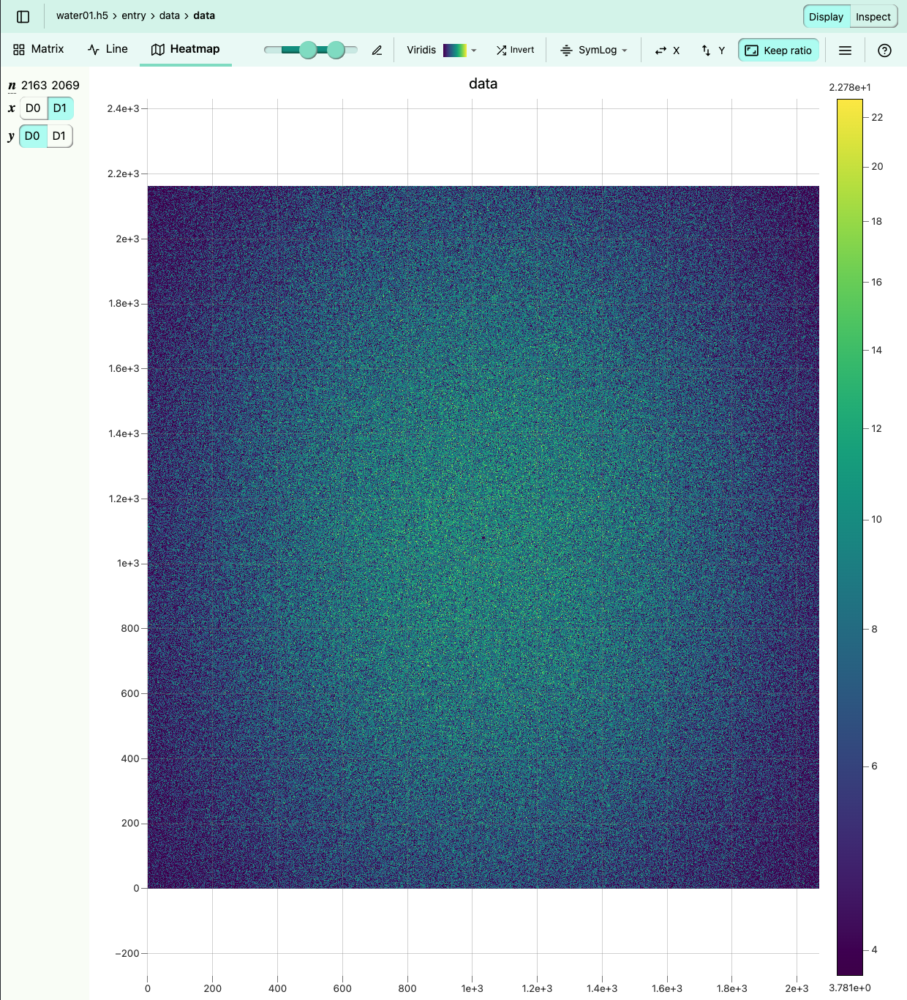
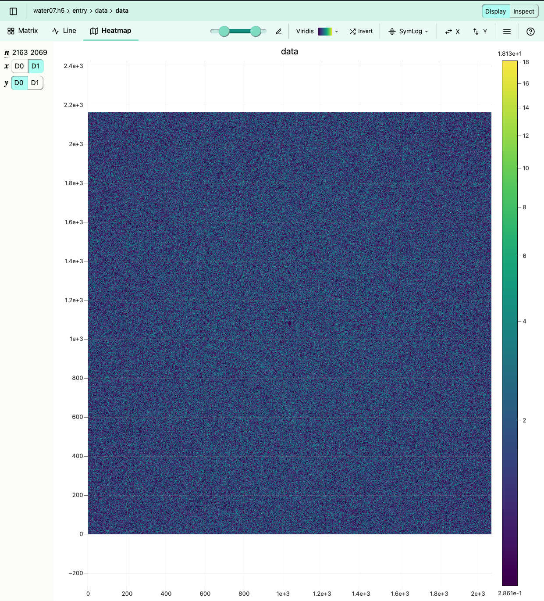

## Enhancing X-ray Crystallography Analysis Through Deep Learning at the Compact X-ray Light Source (CXLS), Arizona State University

Kurth, A. M.1, Everett, E.1, Botha, S.1,2

*The Biodesign Beus CXFEL Laboratory, Arizona State University, Tempe, AZ 85287, USA. 1. Department of Physics, Arizona State University, Tempe, AZ 85287, USA*


Repository can be found here: [cxls_hitfinder](https://github.com/adamkurth/cxls_hitfinder.git)

### Abstract:

The Compact X-ray Light Source (CXLS) at Arizona State University represents a pioneering integration of deep learning methodologies for the analysis of diverse data sets originating from various experimental modalities within the facility. This research primarily utilizes the Dectris Eiger 4M detector, focusing initially on X-ray crystallography. Traditional approaches often necessitate manual predictions concerning the photon energy and the distance between the protein crystal sample and the detector. These predictions are complicated by the dynamic scattering patterns resulting from the intrinsic noise associated with the water within the protein samples. This study delineates the variables of interaction distance (camera length, denoted as "clen" with values of 0.15, 0.25, 0.35 meters) and photon energy (denoted as "photon_energy" with values of 6, 7, 8 keV), discretizing them into three distinct instances to formulate a matrix comprising nine unique variable combinations.

Utilizing CrystFEL[1] software to simulate diffraction images of a specific protein (1IC6.pdb), this research embarked on generating realistic diffraction data across the nine variable combinations by processing initial data, labeling, and applying corresponding water background noise. The objective is threefold: initially, to enable the detection of peaks within these images through binary classification via convolutional neural networks (CNNs), and subsequently, to facilitate the prediction of photon energy and camera length. The model pipeline sequentially addresses binary classification (peak detection), photon energy prediction, and camera length estimation. Preliminary assessments are being conducted on various CNN architectures, including ResNet50, DenseNet, and Basic CNN, to identify the most efficacious model for feature extraction relevant to our analytical objectives.

Further development endeavors to broaden the model's applicability by training on an expanded dataset of various protein PDB samples from simulated data. The aim is to refine the model's capacity for classifying proteins based on the location of Bragg peaks and accurately predicting proteins previously introduced to the model. This expanded scope not only solidifies the model's foundational capabilities in X-ray crystallography analysis but also anticipates its application in material science spectroscopy. Ultimately, this exploration into the application of deep learning for X-ray crystallography at CXLS not only innovates in the realm of experimental data analysis but also sets the stage for future applications in material science spectroscopy, enhancing the precision and efficiency of experimental outcomes.

### Introduction:

At Arizona State University (ASU), we are pioneering the development of the world's first Compact X-ray Light Source (CXLS). This groundbreaking apparatus is capable of emitting x-ray pulses at the femtosecond scale, operating at a frequency of a kilohertz. While the functionality of the CXLS mirrors that of existing technologies in terms of its capabilities, it distinguishes itself through its remarkably reduced size. Traditional x-ray light sources necessitate the use of linear accelerators extending over a mile in length. In contrast, the accelerator integral to the CXLS measures approximately 60 feet, significantly reducing its physical footprint.

This compact design not only translates into substantial cost savings but also paves the way for the proliferation of such machines. The accessibility and affordability of the CXLS are poised to have a transformative impact on a wide array of research domains, including materials science and pharmaceuticals. By democratizing access to advanced x-ray light sources, ASU is at the forefront of enabling groundbr eaking discoveries and innovations across these critical fields.

The CXLS is equipped with a Dectris Eiger 4M detector, which is integral to the facility's x-ray crystallography capabilities. This detector is renowned for its high resolution and sensitivity, enabling the capture of detailed diffraction patterns from protein crystals. However, the analysis of these diffraction patterns is a complex and labor-intensive process, often requiring manual intervention to correct for inaccuracies in the data. The dynamic scattering patterns resulting from the water content within the protein samples further complicate the analysis, necessitating the development of innovative methodologies to enhance the accuracy and efficiency of the process.

### Methods:

This study primarily employs the Dectris Eiger 4M detector, with a focus on X-ray crystallography. Typically, this method requires manual estimation of photon energy and the distance between the protein crystal sample and the detector, often necessitating subsequent adjustments and revision. Such estimations are further complicated by dynamic scattering patterns, which arise from intrinsic noise due to water within the protein samples.

In this research, we specifically analyze the variables of interaction distance (camera length, denoted as "clen") and photon energy. Camera length is examined at increments of 0.15, 0.25, and 0.35 meters, while photon energy is tested at 6, 7, and 8 keV. These variables are organized into three discrete levels each, resulting in a matrix of nine unique combinations of these variables. This structured approach allows for a systematic examination of how each variable combination impacts the scattering patterns and the resultant data quality.

Parameter matrix for `camlen` and `keV`:

| Dataset (`01`-`09`) | camlen (m) | photon energy (keV) |
|---------------|------------|---------------------|
| `01`          | 0.15        | 6                   |
| `02`          | 0.15        | 7                   |
| `03`          | 0.15        | 8                   |
| `04`          | 0.25        | 6                   |
| `05`          | 0.25        | 7                   |
| `06`          | 0.25        | 8                   |
| `07`          | 0.35        | 6                   |
| `08`          | 0.35        | 7                   |
| `09`          | 0.35        | 8                   |

This matrix serves as the foundation for the subsequent data generation and analysis, where the backend programming focus enables the simulated images to dynamically adjust for different datasets to be loaded. The data generation process involves the simulation of diffraction images using the CrystFEL software suite, renowned for its capabilities in snapshot serial crystallography. The diffraction images are generated based on a specific protein (1IC6.pdb) and tailored to the nine unique variable combinations outlined in the matrix. The subsequent analysis involves the extraction of Bragg peaks from these diffraction images, a critical step in the classification and prediction tasks.

#### Structure of the Repository:

The repository structure is organized to facilitate the efficient management of the project's codebase, documentation, and data. 
The following is an overview of the repository structure:

```bash
cxls_hitfinder/
    ├── .gitignore
    ├── .gitkeep
    ├── .gitmodules
    ├── cnn/
    │   ├── models/
    │   │   ├── cnn3_test.pt
    │   │   ├── ...
    │   ├── src/
    │   │   ├── pkg/
    │   │   │   ├── __init__.py
    │   │   │   ├── ...
    │   │   │   ├── water_background/
    │   │   │   │   ├── finder/
    │   │   │   │   │   ├── __init__.py
    │   │   │   │   │   ├── ...
    ├── docs/
    │   ├── diagrams/
    │   ├── directions/
    │   ├── report.md
    ├── images/
    │   ├── labels/
    │   ├── peaks/
    │   ├── peaks_water_overlay/
    │   ├── temp/
    │   ├── water/
    ├── scripts/
    │   ├── 01_09_dir_struc.sh
    │   ├── assign_params.py
    │   ├── checks.sh
    │   ├── peak_water_overlay_label_dir_struc.sh
    │   ├── reformat-h5.py
    │   ├── reformat-h5.sh
    │   ├── rename_directories_parameters.py
    │   ├── test/
    ├── requirements.txt
    ├── hitfinder_env.**yml**
    └── README.md
```

- `.gitignore` and `.gitkeep` are files that specify which files and directories to ignore in Git, namely ignoring the large HDF5 files.
- `.gitmodules` is a file that defines the Git submodules for `waterbackground_subtraction`.
- `cnn/` is a directory containing files related to the Convolutional Neural Network (CNN) implementation.
    - `models/` is a subdirectory that stores trained CNN models.
    - `src/` is a subdirectory that contains source code for the CNN implementation.
        - `pkg/` is a subdirectory that holds the main Python package for implementation.
            - `waterbackground_subtraction/` is a subdirectory and submodule cloned in the Python module `pkg` that contains code related to water background detection and analysis.
                - `finder/` is a Python package that includes code to analyze and estimate peaks using three-ring integration technique.
- `docs/` is a directory for storing documentation for this project.
    - `diagrams/` is a subdirectory for storing diagrams used.
    - `directions/` is a subdirectory for storing directions.
    - `report.md` is a Markdown file that serves as a report.
- `images/` is a directory for storing images used in the project, every dataset (`01`-`09`) is a unique combination of the parameter matrix.
    - `labels/` is a subdirectory for storing labeled images with 01-09 directories.
    - `peaks/` is a subdirectory for storing peak images with 01-09 directories.
    - `peaks_water_overlay/` is a subdirectory for storing peak images with water overlays with 01-09 directories.
    - `water/` is a subdirectory for storing the background water images, with 01-09 directories.
- `scripts/` is a directory for storing scripts useful to use on Agave.
    - `01_09_dir_struc.sh` is a shell script for directory structure management of datasets 01-09.
    - `assign_params.py` is a Python script for assigning parameters of a directory in `images/<directory>`.
    - `checks.sh` is a shell script for performing checks of the number of images in `images/peaks`, `labels`, and `peak_water_overlay`, and all assigned the correct attributes.
    - `peak_water_overlay_label_dir_struc.sh` is a shell script for creating a directory structure for peak, water, and label images.
    - `reformat-h5.py` is a Python script for reformatting the name of H5 files (useful for uniform naming structure).
    - `rename_directories_parameters.py` is a Python script for renaming directories based on parameters combinations (e.g. `01_6keV_clen01`).
- `requirements.txt` is a file that lists the project's dependencies for easy enviornment setup.
- `hitfinder_env.yml` is a YAML file that contains the environment configuration for the project.
- `README.md` is a Markdown file that provides an overview of the project.

Note the contents of `images/`:
- `images/peaks` contains the Bragg peaks images from the simulated diffraction images, the peaks are simulated using CrystalFEL[1] software and do not contain any noise in the images. 
- `images/labels` contains the labels for the Bragg peaks (0 for no peak, 1 for peak present).
- `images/peaks_water_overlay` contains the Bragg peaks overlayed with the respective keV dataset water image `images/water`.
- `images/water` contains the different keV and camera length water images to overlay with `images/peaks` images.

#### Data Generation:

During the data generation phase of the project, we utilize the `pattern_sim`[5] module in CrystFEL software, renowned for generating simulation diffraction images under conditions similar to those of the CXLS. The specific protein used in this study is designated as 1IC6.pdb, obtained from the RCSB Protein Data Bank[2]. Initially, our testing focuses on a medium-sized unit cell, to limit the complexities of the analysis but presents a promising avenue for future research enhancements.

Before commencing the `pattern_sim` simulations, it was essential to create a crystal file and a corresponding water-background image tailored to the specific photon energy and camera length parameter combination as stated in the parameter matrix above. Using the [reborn](https://gitlab.com/kirianlab/reborn)[3] software, we generate the required water-background images for all of the datasets. In reborn, the `water_background.py` the program generates the dynamic water-background images for the specified photon energy and camera length parameters, where these parameters are accessed from the `Eiger.geom` fiile. Thus, for the three camera lengths and three photon energies, we generate nine total water background images, each for one dataset. This will be further explained in the `Water-Background Noise` section.

For generating the crystal file, we employ the SFALL[4] (`sfall`) module from the CCP4 software suite to compute the structure factors of the protein under study. This module outputs an `.hkl` file, which contains the Miller indices associated with the specific `.pdb` file. Additionally, the resulting crystal file is a text document that captures essential details such as the unit-cell dimensions and the crystal’s space group. These data elements are critical as they ensure that our simulations faithfully reproduce the expected diffraction patterns from the protein crystal, facilitating accurate analysis of its structural properties.

##### Water-Background Noise:

The water background noise is a crucial component of the simulated diffraction images, generated by varying the photon energy and camera length. Photon energy is specified in the `Eiger4M.geom` file, while the camera length is defined as the distance between the protein crystal sample and the detector.

The start of the `Eiger4M.geom` file is structured as follows:
```
;Sabine -Eiger for CXLS simulations
; EIGER 4M (2162, 2068) 
; Camera length (in m) and photon energy (eV)

;example!
clen = 0.35
photon_energy = 8000

; adu_per_photon needs a relatively recent CrystFEL version.  If your version is
; older, change it to adu_per_eV and set it to one over the photon energy in eV

;...
```

In the diagrams below, the water-background noise images are displayed for two distinct photon energies (6000 eV and 8000 eV) and camera lengths (0.15 m and 0.25 m). It is clear with these images juxtaposed, the closer the protein sample is to the detector, the more pronounced the water-ring becomes. This phenomenon is due to the increased scattering of x-rays by the water content within the protein sample, resulting in a more prominent water background noise in the diffraction images. By incorporating this water background noise into the simulations, we aim to enhance the authenticity of the diffraction data, thereby facilitating more accurate and reliable analysis of the protein crystal structures.

<p float="left">
    
     
</p>

*Figure 1: Water background noise comparison. Left: (`water01.png`) photon energy is 6000 eV, with camera length is 0.15m. Right: (`water07.png`) photon energy is 8000 eV, with camera length is 0.15m. Both images can be found in `docs/diagrams/`*

##### Crystal Used in Simulations:

According to the RCSB Protein Data Bank, the *proteinase K from Tritirachium album limber* is characterized by a resolution of 0.98 Å. This enzyme is part of the tetragonal crystal system and belongs to the space group $P 4_3 2_1 2$. The unit cell dimensions are defined as $a = b = 58.3$ Å, $c = 63.6$ Å, with the point group being $4/mmm$, or $422$. This deatiled structural information is fundamental to our analysis and facilitates a more precise understanding of the protein's diffraction patterns. Below is a visual representation of the tetragonal crystal system:


*Figure 2: Tetragonal Crystal System*. Available from: [Wikipedia](https://en.m.wikipedia.org/wiki/File:Tetragonal.svg)

#### `pattern_sim` Parameters:

The `submit.sh` script, is located in the `scripts/` directory and is responsible for configuring the parameters used in the `pattern_sim` simulations, and submitting jobs. The script's parameters is structured as follows: 

```bash
#!/bin/bash
# Global configurations
NAME="$1" # Experiment or job prefix
TASKS="$2" #Number of tasks to request for each job
PHOTON_ENERGY="$3" # Photon energy input
# ...

# Pattern_sim configurations
GEOM="Eiger4M.geom" # Geometry file
CRYSTAL="1IC6.cell" # Crystal file
INPUT="1IC6.pdb.hkl" # Constant HKL input file 
POINT_GROUP="4/mmm"                                            
CRYSTAL_SIZE_MIN=1000  
CRYSTAL_SIZE_MAX=1000
SPECTRUM="tophat"
SAMPLING=7
BANDWIDTH=0.01
N_PHOTONS=3e8
BEAM_RADIUS=5e-6                                                              
# ...
```

The `pattern_sim` command is executed within the bottom half of `submit.sh`, with the following parameters:

```bash
pattern_sim -g $GEOM -p $CRYSTAL --number=$cores -o $job_name -i $INPUT -r -y $POINT_GROUP --min-size=$CRYSTAL_SIZE_MIN --max-size=$CRYSTAL_SIZE_MAX --spectrum=$SPECTRUM -s $SAMPLING --background=0 --beam-bandwidth=$BANDWIDTH --photon-energy=$PHOTON_ENERGY --nphotons=$N_PHOTONS --beam-radius=$BEAM_RADIUS
```

The `pattern_sim` command generates the diffraction images based on the specified parameters, including the photon energy, crystal file, and geometry file. The resulting diffraction images are then stored and renamed appropriately for out uses. Note that at this stage, the outputted images are signal only, and will be stored in `images/peaks` after renaming the files.

#### Data Preprocessing:


#### Model Architecture:


#### Training:


#### Evaluation:


### Results:


### Discussion:


### Conclusion:


### Acknowledgements:


### References:

[1] T. A. White, R. A. Kirian, A. V. Martin, A. Aquila, K. Nass, A. Barty and H. N. Chapman. *“CrystFEL: a software suite for snapshot serial crystallography”*. J. Appl. Cryst. **45** (2012), p335–341.

[2] RCSB Protein Data Bank. (n.d.). 1IC6: Structure of a serine protease proteinase K from Tritirachium album limber at 0.98 a resolution. RCSB PDB. https://www.rcsb.org/structure/1ic6 

[3] kirianlab. (n.d.). Kirianlab / reborn · GITLAB. GitLab. https://gitlab.com/kirianlab/reborn 

[4] SFALL (CCP4: Supported program). SFALL (CCP4: Supported Program) - CCP4 documentation. (n.d.). https://www.ccp4.ac.uk/html/sfall.html 

[5] White, T. A., Kirian, R. A., Martin, A. V., Aquila, A., Nass, K., Barty, A., & Chapman, H. N. (2012). CrystFEL: a software suite for snapshot serial crystallography. Journal of Applied Crystallography, 45(2), 335-341. Retrieved from https://www.desy.de/~twhite/crystfel/manual-pattern_sim.html


